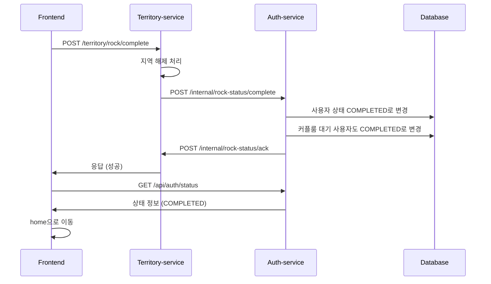

# ROCK_REQUIRED 상태 관리 구현 계획

## 📋 플로우 개요

### 1. 사용자 상태 흐름
```
ONBOARDING_REQUIRED → COUPLE_MATCHING_REQUIRED → ROCK_REQUIRED → COMPLETED
```

### 2. 상세 플로우
1. 사용자가 온보딩, 커플 매칭 완료 → **ROCK_REQUIRED** 상태
2. 사용자가 지역락 해제 페이지에서 지역 선택 → **Territory-service**로 POST 요청
3. **Territory-service**에서 지역 상태 확인 후 해제 처리
4. **Territory-service** → **Auth-service**로 상태 변경 요청 (ROCK_REQUIRED → COMPLETED)
5. **Auth-service**에서 상태를 COMPLETED로 변경
6. **Auth-service** → **Territory-service**로 ACK 응답
7. **Territory-service** → **FE**로 최종 응답
8. **FE**에서 `/api/auth/status` 확인 → home으로 이동

## 🏗️ 구현 방향

### 1. 데이터베이스 변경사항

#### User 엔티티 수정
```java
@Entity
public class User {
    // 기존 필드들...
    
    @Column(name = "is_rock_completed")
    private Boolean isRockCompleted = false;
    
    @Column(name = "rock_completed_at")
    private LocalDateTime rockCompletedAt;
}
```

#### CoupleRoom 엔티티 수정 (선택사항)
```java
@Entity
public class CoupleRoom {
    // 기존 필드들...
    
    @Column(name = "is_rock_completed")
    private Boolean isRockCompleted = false;
    
    @Column(name = "rock_completed_at")
    private LocalDateTime rockCompletedAt;
}
```

### 2. Auth-service API 구현

#### 2.1 Territory-service로부터 상태 변경 요청을 받는 API
```java
@PostMapping("/internal/rock-status/complete")
public ResponseEntity<?> completeRockStatus(
    @RequestBody RockStatusCompleteRequest request) {
    // 1. 사용자 상태를 COMPLETED로 변경
    // 2. 커플룸 대기 중인 사용자도 함께 변경
    // 3. Territory-service로 ACK 응답
}
```

#### 2.2 Territory-service로 ACK를 보내는 로직
```java
@Service
public class TerritoryServiceClient {
    public void sendRockCompletionAck(String coupleId, String userId) {
        // Territory-service로 ACK 전송
    }
}
```

#### 2.3 사용자 상태 조회 API (기존 수정)
```java
@GetMapping("/status")
public ResponseEntity<?> getUserStatus(@AuthenticationPrincipal UserDetails userDetails) {
    // 기존 로직 + isRockCompleted 정보 추가
}
```

### 3. Territory-service 연동

#### 3.1 Auth-service 호출 클라이언트
```java
@Service
public class AuthServiceClient {
    public void requestRockStatusCompletion(String coupleId, String userId) {
        // Auth-service로 상태 변경 요청
    }
}
```

#### 3.2 Auth-service ACK 수신 API
```java
@PostMapping("/internal/rock-status/ack")
public ResponseEntity<?> receiveRockCompletionAck(
    @RequestBody RockCompletionAckRequest request) {
    // Auth-service로부터 ACK 수신 처리
}
```

## 🔧 구현 세부사항

### 1. 상태 변경 로직

#### UserService 수정
```java
@Service
public class UserService {
    @Transactional
    public void completeRockStatus(String userId) {
        User user = getUserById(userId);
        user.setIsRockCompleted(true);
        user.setRockCompletedAt(LocalDateTime.now());
        userRepository.save(user);
    }
    
    @Transactional
    public void completeRockStatusForCouple(String coupleId) {
        // 커플룸의 두 사용자 모두 상태 변경
        CoupleRoom coupleRoom = coupleRoomRepository.findByCoupleId(coupleId);
        if (coupleRoom != null) {
            completeRockStatus(coupleRoom.getCreatorUserId());
            if (coupleRoom.getPartnerUserId() != null) {
                completeRockStatus(coupleRoom.getPartnerUserId());
            }
        }
    }
}
```

### 2. MSA 간 통신

#### HTTP 클라이언트 구현
```java
@Service
public class TerritoryServiceClient {
    private final RestTemplate restTemplate;
    private final String territoryServiceUrl;
    
    public void sendRockCompletionAck(String coupleId, String userId) {
        RockCompletionAckRequest request = new RockCompletionAckRequest(coupleId, userId);
        restTemplate.postForObject(
            territoryServiceUrl + "/internal/rock-status/ack",
            request,
            ResponseEntity.class
        );
    }
}
```

### 3. DTO 클래스

#### 요청/응답 DTO
```java
// Territory-service → Auth-service
public class RockStatusCompleteRequest {
    private String coupleId;
    private String userId;
    private String territoryId;
}

// Auth-service → Territory-service
public class RockCompletionAckRequest {
    private String coupleId;
    private String userId;
    private LocalDateTime completedAt;
}
```

## 📊 데이터베이스 마이그레이션

### 1. User 테이블 수정
```sql
ALTER TABLE users 
ADD COLUMN is_rock_completed BOOLEAN DEFAULT FALSE,
ADD COLUMN rock_completed_at TIMESTAMP;
```

### 2. CoupleRoom 테이블 수정 (선택사항)
```sql
ALTER TABLE couple_room 
ADD COLUMN is_rock_completed BOOLEAN DEFAULT FALSE,
ADD COLUMN rock_completed_at TIMESTAMP;
```

## 🔄 플로우 다이어그램



## 🚀 구현 순서

1. **데이터베이스 스키마 수정** (User 테이블에 rock 관련 필드 추가)
2. **Auth-service API 구현** (상태 변경 요청 수신, ACK 전송)
3. **Territory-service 연동** (Auth-service 호출 클라이언트)
4. **기존 리다이렉트 로직 수정** (isRockCompleted 반영)
5. **테스트 및 검증**

## ⚠️ 주의사항

1. **트랜잭션 관리**: 커플룸의 두 사용자 상태 변경 시 원자성 보장
2. **에러 처리**: Territory-service 연동 실패 시 롤백 처리
3. **로깅**: 상태 변경 과정의 상세 로깅
4. **모니터링**: MSA 간 통신 상태 모니터링
5. **보안**: 내부 API는 적절한 인증/인가 처리

## 📝 추가 고려사항

1. **재시도 로직**: Territory-service 연동 실패 시 재시도
2. **상태 동기화**: 두 서비스 간 상태 불일치 방지
3. **성능**: 대량의 상태 변경 요청 처리
4. **확장성**: 향후 다른 서비스와의 연동 고려
