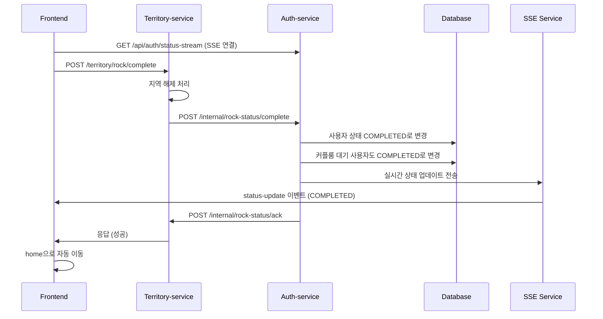

# ROCK_REQUIRED 상태 관리 구현 계획

## 📋 플로우 개요

### 1. 사용자 상태 흐름
```
ONBOARDING_REQUIRED → COUPLE_MATCHING_REQUIRED → ROCK_REQUIRED → COMPLETED
```

### 2. 상세 플로우
1. 사용자가 온보딩, 커플 매칭 완료 → **ROCK_REQUIRED** 상태
2. 사용자가 지역락 해제 페이지에서 지역 선택 → **Territory-service**로 POST 요청
3. **Territory-service**에서 지역 상태 확인 후 해제 처리
4. **Territory-service** → **Auth-service**로 상태 변경 요청 (ROCK_REQUIRED → COMPLETED)
5. **Auth-service**에서 상태를 COMPLETED로 변경
6. **Auth-service** → **Territory-service**로 ACK 응답
7. **Territory-service** → **FE**로 최종 응답
8. **FE**에서 SSE를 통해 실시간 상태 변경 수신 → home으로 이동

## 🏗️ 구현 방향

### 1. 데이터베이스 변경사항

#### User 엔티티 수정
```java
@Entity
public class User {
    // 기존 필드들...
    
    @Column(name = "is_rock_completed")
    private Boolean isRockCompleted = false;
    
    @Column(name = "rock_completed_at")
    private LocalDateTime rockCompletedAt;
}
```

#### CoupleRoom 엔티티 수정 (선택사항)
```java
@Entity
public class CoupleRoom {
    // 기존 필드들...
    
    @Column(name = "is_rock_completed")
    private Boolean isRockCompleted = false;
    
    @Column(name = "rock_completed_at")
    private LocalDateTime rockCompletedAt;
}
```

### 2. Auth-service API 구현

#### 2.1 Territory-service로부터 상태 변경 요청을 받는 API
```java
@PostMapping("/internal/rock-status/complete")
public ResponseEntity<?> completeRockStatus(
    @RequestBody RockStatusCompleteRequest request) {
    // 1. 사용자 상태를 COMPLETED로 변경
    // 2. 커플룸 대기 중인 사용자도 함께 변경
    // 3. SSE로 실시간 상태 업데이트 전송
    // 4. Territory-service로 ACK 응답
}
```

#### 2.2 Territory-service로 ACK를 보내는 로직
```java
@Service
public class TerritoryServiceClient {
    public void sendRockCompletionAck(String coupleId, String userId) {
        // Territory-service로 ACK 전송
    }
}
```

#### 2.3 사용자 상태 조회 API (기존 수정)
```java
@GetMapping("/status")
public ResponseEntity<?> getUserStatus(@AuthenticationPrincipal UserDetails userDetails) {
    // 기존 로직 + isRockCompleted 정보 추가
}
```

#### 2.4 SSE 엔드포인트 (새로 추가)
```java
@GetMapping(value = "/status-stream", produces = MediaType.TEXT_EVENT_STREAM_VALUE)
public SseEmitter streamUserStatus(@AuthenticationPrincipal UserDetails userDetails) {
    // SSE 연결 설정 및 관리
}
```

### 3. Territory-service 연동

#### 3.1 Auth-service 호출 클라이언트
```java
@Service
public class AuthServiceClient {
    public void requestRockStatusCompletion(String coupleId, String userId) {
        // Auth-service로 상태 변경 요청
    }
}
```

#### 3.2 Auth-service ACK 수신 API
```java
@PostMapping("/internal/rock-status/ack")
public ResponseEntity<?> receiveRockCompletionAck(
    @RequestBody RockCompletionAckRequest request) {
    // Auth-service로부터 ACK 수신 처리
}
```

## 🔧 구현 세부사항

### 1. 상태 변경 로직

#### UserService 수정
```java
@Service
public class UserService {
    @Autowired
    private SseService sseService;
    
    @Transactional
    public void completeRockStatus(String userId) {
        User user = getUserById(userId);
        user.setIsRockCompleted(true);
        user.setRockCompletedAt(LocalDateTime.now());
        userRepository.save(user);
    }
    
    @Transactional
    public void completeRockStatusForCouple(String coupleId) {
        // 커플룸의 두 사용자 모두 상태 변경
        CoupleRoom coupleRoom = coupleRoomRepository.findByCoupleId(coupleId);
        if (coupleRoom != null) {
            completeRockStatus(coupleRoom.getCreatorUserId());
            if (coupleRoom.getPartnerUserId() != null) {
                completeRockStatus(coupleRoom.getPartnerUserId());
            }
            
            // 커플룸 상태 업데이트
            coupleRoom.setIsRockCompleted(true);
            coupleRoom.setRockCompletedAt(LocalDateTime.now());
            coupleRoomRepository.save(coupleRoom);
            
            // SSE로 실시간 상태 업데이트 전송
            Map<String, Object> statusData = Map.of(
                "status", "COMPLETED",
                "redirectUrl", "/home",
                "isRockCompleted", true,
                "timestamp", LocalDateTime.now().toString()
            );
            
            sseService.sendStatusUpdateToCouple(coupleId, statusData);
        }
    }
}
```

### 2. SSE 서비스 구현

#### SSE 연결 관리 서비스
```java
@Service
@Slf4j
public class SseService {
    
    private final Map<String, SseEmitter> connections = new ConcurrentHashMap<>();
    private final CoupleRoomRepository coupleRoomRepository;
    
    public void addConnection(String userId, SseEmitter emitter) {
        connections.put(userId, emitter);
        log.info("SSE 연결 추가 - userId: {}", userId);
        
        // 연결 종료 시 정리
        emitter.onCompletion(() -> removeConnection(userId));
        emitter.onTimeout(() -> removeConnection(userId));
        emitter.onError((ex) -> removeConnection(userId));
    }
    
    public void removeConnection(String userId) {
        connections.remove(userId);
        log.info("SSE 연결 제거 - userId: {}", userId);
    }
    
    public void sendStatusUpdate(String userId, Map<String, Object> data) {
        SseEmitter emitter = connections.get(userId);
        if (emitter != null) {
            try {
                emitter.send(SseEmitter.event()
                    .name("status-update")
                    .data(data));
                log.info("SSE 상태 업데이트 전송 - userId: {}", userId);
            } catch (Exception e) {
                log.error("SSE 전송 실패 - userId: {}, error: {}", userId, e.getMessage());
                removeConnection(userId);
            }
        }
    }
    
    public void sendStatusUpdateToCouple(String coupleId, Map<String, Object> data) {
        CoupleRoom coupleRoom = coupleRoomRepository.findByCoupleId(coupleId);
        if (coupleRoom != null) {
            // 생성자에게 전송
            sendStatusUpdate(coupleRoom.getCreatorUserId(), data);
            
            // 참여자에게 전송
            if (coupleRoom.getPartnerUserId() != null) {
                sendStatusUpdate(coupleRoom.getPartnerUserId(), data);
            }
        }
    }
}
```

#### SSE 컨트롤러
```java
@RestController
@RequestMapping("/api/auth")
public class AuthController {
    
    @Autowired
    private SseService sseService;
    
    @GetMapping(value = "/status-stream", produces = MediaType.TEXT_EVENT_STREAM_VALUE)
    public SseEmitter streamUserStatus(@AuthenticationPrincipal UserDetails userDetails) {
        String userId = userDetails.getUsername();
        SseEmitter emitter = new SseEmitter(Long.MAX_VALUE); // 무제한 연결
        
        // SSE 연결 관리
        sseService.addConnection(userId, emitter);
        
        return emitter;
    }
}
```

### 3. MSA 간 통신

#### HTTP 클라이언트 구현
```java
@Service
public class TerritoryServiceClient {
    private final RestTemplate restTemplate;
    private final String territoryServiceUrl;
    
    public void sendRockCompletionAck(String coupleId, String userId) {
        RockCompletionAckRequest request = new RockCompletionAckRequest(coupleId, userId);
        restTemplate.postForObject(
            territoryServiceUrl + "/internal/rock-status/ack",
            request,
            ResponseEntity.class
        );
    }
}
```

### 4. DTO 클래스

#### 요청/응답 DTO
```java
// Territory-service → Auth-service
public class RockStatusCompleteRequest {
    private String coupleId;
    private String userId;
    private String territoryId;
}

// Auth-service → Territory-service
public class RockCompletionAckRequest {
    private String coupleId;
    private String userId;
    private LocalDateTime completedAt;
}
```

## 🎨 프론트엔드 구현

### 1. SSE 연결 설정
```javascript
// 커플룸 생성 페이지에서
class StatusStreamManager {
    constructor() {
        this.eventSource = null;
        this.reconnectAttempts = 0;
        this.maxReconnectAttempts = 5;
        this.reconnectDelay = 5000;
    }
    
    connect() {
        this.eventSource = new EventSource('/api/auth/status-stream');
        
        this.eventSource.addEventListener('status-update', (event) => {
            this.handleStatusUpdate(event);
        });
        
        this.eventSource.onerror = (event) => {
            this.handleError(event);
        };
    }
    
    handleStatusUpdate(event) {
        const data = JSON.parse(event.data);
        
        if (data.status === 'COMPLETED') {
            this.showNotification('상태가 업데이트되었습니다. 홈페이지로 이동합니다.');
            
            setTimeout(() => {
                window.location.href = data.redirectUrl;
            }, 2000);
        }
    }
    
    handleError(event) {
        console.error('SSE 연결 오류:', event);
        
        if (this.reconnectAttempts < this.maxReconnectAttempts) {
            this.reconnectAttempts++;
            setTimeout(() => {
                this.reconnect();
            }, this.reconnectDelay);
        } else {
            console.error('SSE 재연결 실패 - 최대 시도 횟수 초과');
        }
    }
    
    reconnect() {
        this.eventSource.close();
        this.connect();
    }
    
    disconnect() {
        if (this.eventSource) {
            this.eventSource.close();
        }
    }
    
    showNotification(message) {
        // 알림 표시 로직 (예: toast, modal 등)
        console.log(message);
    }
}

// 사용
const statusStream = new StatusStreamManager();
statusStream.connect();

// 페이지 언로드 시 연결 종료
window.addEventListener('beforeunload', () => {
    statusStream.disconnect();
});
```

### 2. 페이지별 적용
```javascript
// 커플룸 생성 페이지에서만 SSE 연결
if (window.location.pathname.includes('/coupleroom')) {
    const statusStream = new StatusStreamManager();
    statusStream.connect();
    
    // 페이지 언로드 시 연결 종료
    window.addEventListener('beforeunload', () => {
        statusStream.disconnect();
    });
}
```

## 📊 데이터베이스 마이그레이션

### 1. User 테이블 수정
```sql
ALTER TABLE users 
ADD COLUMN is_rock_completed BOOLEAN DEFAULT FALSE,
ADD COLUMN rock_completed_at TIMESTAMP;
```

### 2. CoupleRoom 테이블 수정 (선택사항)
```sql
ALTER TABLE couple_room 
ADD COLUMN is_rock_completed BOOLEAN DEFAULT FALSE,
ADD COLUMN rock_completed_at TIMESTAMP;
```

## 🔄 플로우 다이어그램



## 🚀 구현 순서

1. **데이터베이스 스키마 수정** (User 테이블에 rock 관련 필드 추가)
2. **SSE 서비스 구현** (연결 관리, 상태 업데이트 전송)
3. **Auth-service API 구현** (상태 변경 요청 수신, ACK 전송)
4. **Territory-service 연동** (Auth-service 호출 클라이언트)
5. **기존 리다이렉트 로직 수정** (isRockCompleted 반영)
6. **프론트엔드 SSE 연결** (실시간 상태 수신)
7. **테스트 및 검증**

## ⚠️ 주의사항

1. **트랜잭션 관리**: 커플룸의 두 사용자 상태 변경 시 원자성 보장
2. **에러 처리**: Territory-service 연동 실패 시 롤백 처리
3. **로깅**: 상태 변경 과정의 상세 로깅
4. **모니터링**: MSA 간 통신 상태 모니터링
5. **보안**: 내부 API는 적절한 인증/인가 처리
6. **SSE 연결 관리**: 사용자가 페이지를 떠나면 연결 정리
7. **재연결 로직**: SSE 연결 실패 시 자동 재연결

## 📝 추가 고려사항

1. **재시도 로직**: Territory-service 연동 실패 시 재시도
2. **상태 동기화**: 두 서비스 간 상태 불일치 방지
3. **성능**: 대량의 상태 변경 요청 처리
4. **확장성**: 향후 다른 서비스와의 연동 고려
5. **SSE 성능**: 대량의 연결 시 메모리 사용량 모니터링
6. **브라우저 호환성**: SSE 지원 브라우저 확인

## 🎯 핵심 장점

1. **실시간 동기화**: 두 사용자가 동시에 상태 변경을 받음
2. **자동 리다이렉트**: 커플룸 생성자가 자동으로 홈페이지로 이동
3. **가벼운 구현**: WebSocket보다 리소스 사용량 적음
4. **자동 재연결**: 브라우저가 자동으로 재연결 시도
5. **사용자 경험**: 매끄러운 상태 전환과 알림
